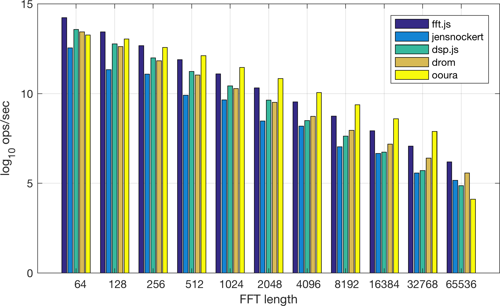

Javascript FFT Benchmarks
=========================================

This is a fork of the benchmark code found in [fft.js](https://github.com/indutny/fft.js), modified to work standalone. Send me pull requests to add your FFT library implementation, or any wildly different results on other platforms!


#### Usage
```
> npm install
> node .
```

#### Motivation
I made this repo to test my own efforts on porting of ooura, available on [GitHub](https://github.com/audioplastic/ooura) and [npm](https://www.npmjs.com/package/ooura).

#### Libraries currently under test:
- [fft.js](https://www.npmjs.com/package/fft.js) - indutny
- [fft](https://www.npmjs.com/package/fft) - jensnockert
- [dsp.js](https://github.com/corbanbrook/dsp.js) - corban brook
- [fourier](https://www.npmjs.com/package/fourier) - drom
- [ooura](https://www.npmjs.com/package/ooura) - audioplastic


Results - 31st August 2017
-------------------------




- Node: 8.4.0
- Machine: Macbook pro, Intel Core i5, 8 GB 2133 MHz LPDDR3
- OS: macOS Sierra 10.12.6


```
===== transform size=64 =====
    fft.js x 1,515,255 ops/sec ±1.09% (87 runs sampled)
    jensnockert x 280,859 ops/sec ±1.15% (89 runs sampled)
    dsp.js x 786,193 ops/sec ±0.96% (91 runs sampled)
    drom x 689,652 ops/sec ±0.98% (92 runs sampled)
    ooura x 573,801 ops/sec ±1.25% (92 runs sampled)
  Fastest is fft.js
===== transform size=128 =====
    fft.js x 685,960 ops/sec ±1.01% (87 runs sampled)
    jensnockert x 83,668 ops/sec ±0.87% (93 runs sampled)
    dsp.js x 353,437 ops/sec ±1.13% (91 runs sampled)
    drom x 304,607 ops/sec ±0.98% (91 runs sampled)
    ooura x 460,704 ops/sec ±0.73% (93 runs sampled)
  Fastest is fft.js
===== transform size=256 =====
    fft.js x 318,872 ops/sec ±0.95% (91 runs sampled)
    jensnockert x 65,524 ops/sec ±0.96% (91 runs sampled)
    dsp.js x 160,207 ops/sec ±1.08% (86 runs sampled)
    drom x 137,864 ops/sec ±1.04% (90 runs sampled)
    ooura x 286,858 ops/sec ±1.18% (91 runs sampled)
  Fastest is fft.js
===== transform size=512 =====
    fft.js x 146,203 ops/sec ±1.19% (92 runs sampled)
    jensnockert x 20,233 ops/sec ±1.06% (93 runs sampled)
    dsp.js x 75,259 ops/sec ±1.06% (90 runs sampled)
    drom x 61,896 ops/sec ±1.07% (92 runs sampled)
    ooura x 182,894 ops/sec ±1.17% (93 runs sampled)
  Fastest is ooura
  ===== transform size=1024 =====
    fft.js x 65,973 ops/sec ±1.08% (93 runs sampled)
    jensnockert x 15,456 ops/sec ±1.19% (91 runs sampled)
    dsp.js x 33,936 ops/sec ±1.01% (91 runs sampled)
    drom x 29,342 ops/sec ±0.89% (90 runs sampled)
    ooura x 94,126 ops/sec ±0.88% (93 runs sampled)
  Fastest is ooura
===== transform size=2048 =====
    fft.js x 30,428 ops/sec ±1.10% (89 runs sampled)
    jensnockert x 4,789 ops/sec ±0.90% (91 runs sampled)
    dsp.js x 15,285 ops/sec ±1.00% (92 runs sampled)
    drom x 13,590 ops/sec ±0.92% (92 runs sampled)
    ooura x 50,954 ops/sec ±0.90% (93 runs sampled)
  Fastest is ooura
===== transform size=4096 =====
    fft.js x 13,810 ops/sec ±0.91% (92 runs sampled)
    jensnockert x 3,599 ops/sec ±0.89% (93 runs sampled)
    dsp.js x 4,909 ops/sec ±0.77% (92 runs sampled)
    drom x 6,239 ops/sec ±1.02% (92 runs sampled)
    ooura x 23,334 ops/sec ±0.97% (93 runs sampled)
  Fastest is ooura
  ===== transform size=8192 =====
    fft.js x 6,280 ops/sec ±1.09% (93 runs sampled)
    jensnockert x 1,134 ops/sec ±0.98% (90 runs sampled)
    dsp.js x 2,060 ops/sec ±1.02% (93 runs sampled)
    drom x 2,838 ops/sec ±1.67% (90 runs sampled)
    ooura x 11,777 ops/sec ±1.62% (90 runs sampled)
  Fastest is ooura
===== transform size=16384 =====
    fft.js x 2,767 ops/sec ±1.47% (90 runs sampled)
    jensnockert x 779 ops/sec ±2.20% (84 runs sampled)
    dsp.js x 849 ops/sec ±1.08% (89 runs sampled)
    drom x 1,326 ops/sec ±1.03% (90 runs sampled)
    ooura x 5,420 ops/sec ±0.93% (93 runs sampled)
  Fastest is ooura
===== transform size=32768 =====
    fft.js x 1,184 ops/sec ±1.03% (90 runs sampled)
    jensnockert x 263 ops/sec ±1.25% (83 runs sampled)
    dsp.js x 302 ops/sec ±0.98% (89 runs sampled)
    drom x 602 ops/sec ±1.11% (87 runs sampled)
    ooura x 2,677 ops/sec ±1.05% (91 runs sampled)
  Fastest is ooura
===== transform size=65536 =====
    fft.js x 490 ops/sec ±1.03% (86 runs sampled)
    jensnockert x 175 ops/sec ±1.73% (80 runs sampled)
    dsp.js x 130 ops/sec ±0.92% (81 runs sampled)
    drom x 264 ops/sec ±1.29% (82 runs sampled)
    ooura x 60.47 ops/sec ±2.72% (62 runs sampled)
  Fastest is fft.js
  ```
